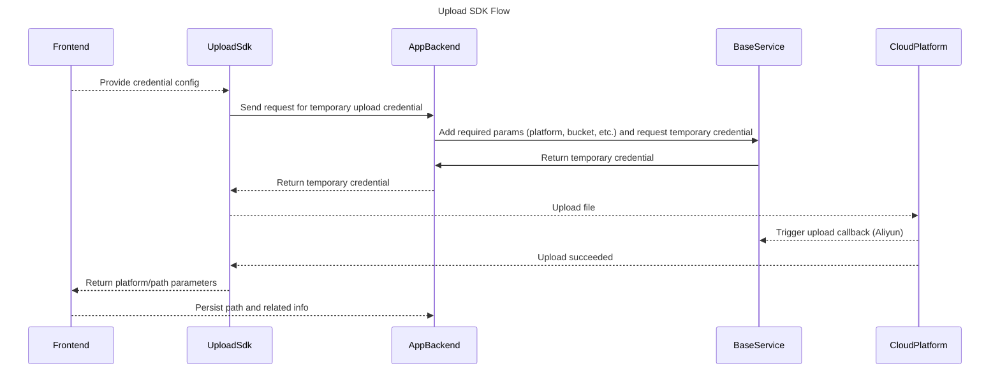

# Upload SDK

Unified upload toolkit supporting Aliyun OSS, Volcengine TOS, and Huawei OBS, with planned support for Tencent COS, Qiniu Kodo, Baidu BOS, NetEase NOS, and more.

## Quick Start

1) Install @dtyq/upload-sdk

```bash
npm install @dtyq/upload-sdk
```

2) Upload a file with upload-sdk (basic example):

```ts
const uploadTask = uploadSDK.upload({
  url: "your back-end interface",
  method: "GET",
  file: yourFile, // File
  fileName: yourFileName, // File name
  headers: {
    "request-id": Date.now(),
  },
});

if (uploadTask.success) {
  uploadTask.success((res: result) =>
    console.log(`Upload complete: ${JSON.stringify(res)}`),
  );
}

if (uploadTask.progress) {
  uploadTask.progress((percent, loaded, total) =>
    console.log(`File upload progress: ${percent}%`, loaded, total),
  );
}

if (uploadTask.fail) {
  uploadTask.fail((response) => console.log("- fail response -", response));
}

// ---------- Single upload task ----------
// Cancel upload
uploadTask.cancel();
// Pause upload
uploadTask.pause();
// Resume upload
uploadTask.resume();
```

## Upload Flow



Note: Volcengine does not currently support upload callbacks, but the flow remains unchanged.

## Performance Features

### Code splitting and on-demand loading

Starting from version x.x.x, upload-sdk supports code splitting and on-demand loading of platform modules. Adapters are loaded only when needed, reducing initial bundle size and improving startup performance.

#### Usage

Asynchronous import (recommended):

```typescript
import { Upload, loadPlatformModule, PlatformType } from "@dtyq/upload-sdk";

// Preload specific platform modules (optional)
async function preloadModules() {
  // Load only required platform modules
  await loadPlatformModule(PlatformType.ALiYun);
  console.log("Aliyun module loaded");
}

// Or auto-load during upload
const upload = new Upload();
upload.upload({
  url: "your-api-url",
  method: "POST",
  file: yourFile,
  fileName: "example.jpg",
  // ... other options
});
```

Compatibility mode (backward-compatible):

```typescript
import { Upload } from "@dtyq/upload-sdk";

// Continue using the original approach; SDK will lazy-load internally
const upload = new Upload();
// ... other code unchanged
```

## Supported Platforms

| Platform     | Status          | Notes                                            |
| ------------ | ---------------- | ------------------------------------------------ |
| Aliyun OSS   | ✅ Supported     | Multipart upload, checkpoint resume supported    |
| Volcengine TOS | ✅ Supported   | Multipart upload, checkpoint resume supported    |
| Huawei OBS   | ✅ Supported     | Multipart upload, checkpoint resume supported    |
| Qiniu Kodo   | ✅ Supported     | Basic upload supported                           |
| Tencent COS  | 🔄 Planned       | In development                                   |
| Baidu BOS    | 🔄 Planned       | In development                                   |
| NetEase NOS  | 🔄 Planned       | In development                                   |
| MinIO/S3     | ✅ Supported     | Multipart upload, checkpoint resume supported    |
| Azure Blob   | 🔄 Planned       | In development                                   |

> For platforms not yet supported, please open an issue or PR to help us prioritize.


