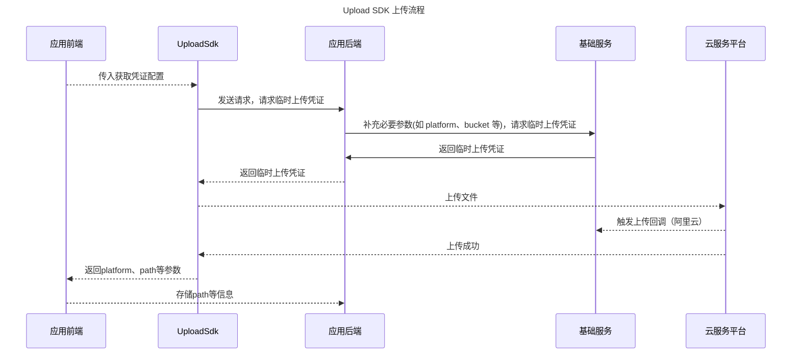

# Upload SDK

统一上传组件，提供阿里云OSS、火山云TOS、华为云OBS等，后续持续扩展支持腾讯云COS、七牛云Kodo、百度BOS、网易NOS等上传能力。

## 快速开始

① 安装 @dtyq/upload-sdk

```bash
npm install @dtyq/upload-sdk
```

② 使用 upload-sdk 上传文件，以下是一个基本的示例：

```ts
const uploadTask = uploadSDK.upload({
  url: "your back-end interface",
  method: "GET",
  file: yourFile, // 文件
  fileName: yourFileName, // 文件名
  headers: {
    "request-id": Date.now(),
  },
});
if (uploadTask.success) {
  uploadTask.success((res: result) =>
    console.log(`上传完毕：${JSON.stringify(res)}`),
  );
}
if (uploadTask.progress) {
  uploadTask.progress((precent, loaded, total) =>
    console.log(`文件上传进度：${precent}%`, loaded, total),
  );
}
if (uploadTask.fail) {
  uploadTask.fail((response) => console.log("- fail response -", response));
}

// ---------- 单个上传任务 ----------
// 取消上传
uploadTask.cancel();
// 暂停上传
uploadTask.pause();
// 恢复上传
uploadTask.resume();
```

## 上传流程



PS：上传回调，火山云暂不支持，但不影响流程。

## 性能优化特性

### 代码分割和按需加载

从版本 x.x.x 开始，upload-sdk 支持代码分割和平台模块的按需加载。这意味着在初始化时不会加载所有云存储平台的适配器，只有在实际需要时才会加载，从而减少初始包体积并提高应用启动性能。

#### 使用方式

使用异步导入方式（推荐）：

```typescript
import { Upload, loadPlatformModule, PlatformType } from "@dtyq/upload-sdk";

// 预加载特定平台模块（可选）
async function preloadModules() {
  // 仅加载所需的平台模块
  await loadPlatformModule(PlatformType.ALiYun);
  console.log("阿里云模块已加载");
}

// 或者在上传时自动加载
const upload = new Upload();
upload.upload({
  url: "your-api-url",
  method: "POST",
  file: yourFile,
  fileName: "example.jpg",
  // ... 其他配置
});
```

使用兼容模式（向后兼容）：

```typescript
import { Upload } from "@dtyq/upload-sdk";

// 继续使用原有方式，SDK 会在内部自动按需加载模块
const upload = new Upload();
// ... 其他代码保持不变
```

## 支持平台

下表列出了当前支持的云存储平台以及计划在未来版本中支持的平台：

| 平台        | 状态        | 说明                         |
| ----------- | ----------- | ---------------------------- |
| 阿里云 OSS  | ✅ 已支持   | 支持分片上传、断点续传等功能 |
| 火山云 TOS  | ✅ 已支持   | 支持分片上传、断点续传等功能 |
| 华为云 OBS  | ✅ 已支持   | 支持分片上传、断点续传等功能 |
| 七牛云 Kodo | ✅ 已支持   | 目前支持基础上传功能         |
| 腾讯云 COS  | 🔄 计划支持 | 开发中                       |
| 百度云 BOS  | 🔄 计划支持 | 开发中                       |
| 网易云 NOS  | 🔄 计划支持 | 开发中                       |
| MinIO/S3    | ✅ 已支持   | 支持分片上传、断点续传等功能  |
| Azure Blob  | 🔄 计划支持 | 开发中                       |

> 注：对于尚未支持的平台，您可以通过提交 Issue 或 PR 来帮助我们加快开发进度。
